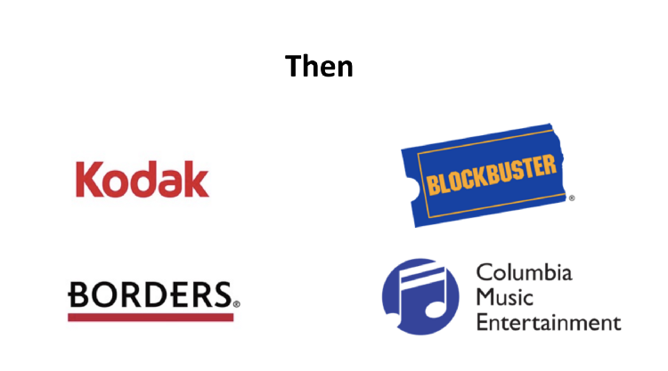
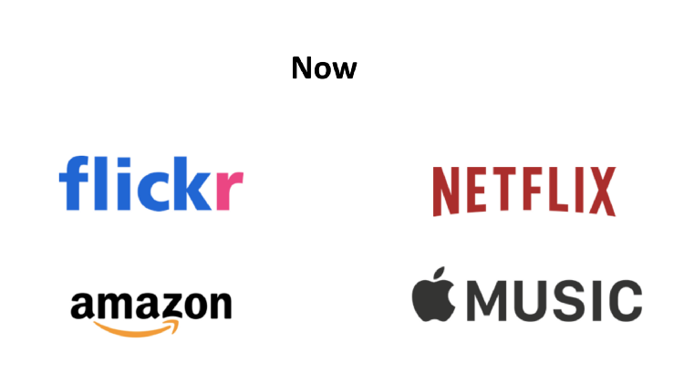

# Sparkify

## Motivation 
Attracting new customers to your innovative and lucrative business might be easy in some cases. But the real effort thereafter is in retaining those customers in the long run. 

Churn is a disease which has to be proactively eradicated before it affects your business. A lot of companies who have been successful in the past have fallen in a matter of years because they couldn't manage churn well. 

You can read more about it in my [blog](https://medium.com/@nirupanda.296/customer-churn-prediction-for-an-imaginary-music-streaming-service-using-spark-1a3d7806c676?source=friends_link&sk=a2e911112c034ac16b8c9c945ebc5543).




[Source](https://medium.com/@MaraxAI/part-1-what-is-churn-and-why-should-consumer-internet-companies-worry-about-it-c032af93f26d)

## Problem Description

The data which is provided is a simulated data for an imaginary music streaming service. It is in the form of userId and their corresponding action/event which has transpired over a certain period of time.

Our aim is to predict whether a user is going to churn ie. give up on the streaming service completely based on their interactions with the app. 

To evaluate our predictive model, we are using F1 score. This is because upon investigation of the dataset, there are more non-churned users than churned users. To combat this imbalance I went with F1 score.

To be more precise, recall should be high, that is, we should work upon decreasing false negatives. We can work with lower precision since it would not harm us if we predict some users as churned even if they are not showing signs of any churning.

## Requirements

The following important libraries are required - 
* pandas
* matplotlib
* seaborn
* pyspark

**Note**: The notebook can't be run since the data is missing. You'll have to download the data from Udacity's link. 

## Files included

There are two files - 
* Sparkify.ipynb

This notebook consists of data exploration, appropriate visualizations, feature engineering and modelling experiments.

* train.py

All the functions used throughout the notebook are combined together in this file. To run this, you need to have all the dependencies installed.

```
$ python train.py
```

## Result Summary

I found that Logistic Regression takes the stage with an F1-score of 0.46. I'm pretty sure with better feature engineering we can go above that.

The performances of random forest and decision trees were similar with less than satisfactory F1-score of 0.4. 

I tried fine tuning the random forest model by using a CrossValidator but it seemed to give poor results. All the details can be found in the `Sparkify.ipynb` notebook.

## Further Scope

Going ahead we can make use of instances of Submit Downgrade event. This indicates the users who have downgraded from a premium subscription to a free one. Incorporating this feature will definitely be useful in the long run.
 
Also since we have a bunch of time series data, it would be interesting to find out time-range patterns and essentially pursue potential churn customers to take a targeted action.
